# Abstract

- adversarial process(적대적인 과정)을 통해 Generative Model을 추정하는 프레임워크 제안
- Generative model G와 Discriminative model D 2개의 모델을 학습한다.
- G는 D가 구별하지 못하도록 Train Data의 분포를 근사한다.
- D는 실제 Train Data인지 G가 생성한 데이터인지 확률을 추정한다.

# Introduction

- Deep generative model은 최대 가능도 추정과 관련된 전략들에서 발생하는 많은 확률 연산들을 근사할 때의 어려움과 generative context에서는 기존 deep learning model의 큰 성공을 이끌었던 선형 piecewise linear units의 이점들을 가져오는 것의 어려움이 있어 큰 임팩트가 없었다. 이러한 어려움을 해결하기 위해 이 논문에서는 새로운 모델 추정 과정을 제안하였다.
- 이 논문에서 소개하는 adversarial nets framework에서 생성 모델은 sample이 생성 모델이 생성한 분포인지 진짜 데이터의 분포인지를 판별하는 discriminative model과 이에 맞서 싸우는 생성 모델로 이루어져있다.

# BackGround

- KL Divergence

    두 확률 분포의 다름의 정도를 설명한다.

    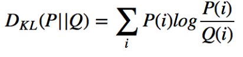

    머신러닝에서 아직 확인되지 않은 모델을 특정 확률 분포로 근사 시킬 때 KL Divergence를 사용한다. 실제 데이터를 가장 잘 표현하는 정규분포를 구하려면 KL Divergence를 가장 낮게 만드는 정규 분포를 구하면된다.

- Jensen-Shannon Divergence(JSD)

    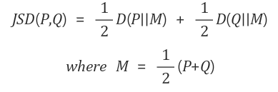

# Adversarial nets

- Discriminator D는 실제 데이터가 들어왔을 경우 1(진짜), Generator로부터 생성된 데이터가 들어왔을 경우 0(가짜)라고 판별 해야한다. 즉 D는 진짜 데이터 x가 들어올 때만 1이 되도록 학습이 진행된다.(logD(x), log(1-D(G(z))를 maximize한다.) 이에 맞서 Generator G는 D가 1(진짜)로 판단하도록(D(G(z))가 1이 되도록) 학습이 진행된다(log(1 -D(G(z)))를 minimize 한다.).

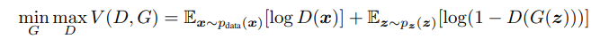

- 학습을 진행하면서 D를 최적화하는것은 많은 계산이 필요하고 한정된 데이터셋에서 overfitting을 초래할 수 있다. 따라서 이 논문에서는 k step만큼 D를 최적화 하고 G는 1 step만큼 최적화 하도록 한다.
- 실제 위의 수식은 G가 학습하기에 충분한 기울기를 제공하지 않을 수 있다.학습 초기를 생각해보면 G는 말도안되는 데이터를 생성할것이기 때문에 D는 가짜 데이터를 쉽게 판별할 수 있다. 이 경우 log(1-D(G(z))의 gradient는 너무 작은 값이되어 학습이 잘 되지 않게된다. log(1-D(G(z))에서 G를 minimize하는것 보다 logD(G(z))를 maximize하는것으로 학습할 수 있다.

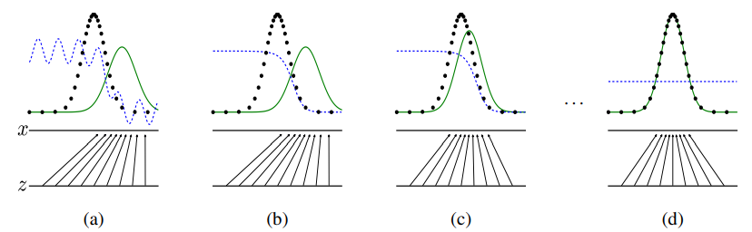

- 위의 그림은 논문에서 학습이 어떻게 진행 되는지를 보여주는 그림이다. 검은 점선은 real data distribution, 초록 실선은 generative distribution, 파란 점선은 discriminative distribution을 나타낸다. x와 z는 생성기가 noise z를 data space의 x로 mapping하는 것을 나타낸다.

    (a). 맨 처음 실제 데이터와 generator의 결과도 차이가나고 discriminator도 성능이 좋지않다.

    (b). G를 고정하고 D를 학습시켜 가짜 데이터를 구분할 수 있게한다.

     G를 고정한다면 D*(x)는 아래의 식으로 나타낼 수 있다.(미분해보면)

    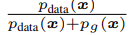

    (c). D를 고정하고 D의 gradient를 이용해 G를 학습시킨다.

    (d). (b),(c)를 반복해 generator는 discriminator가 구분할 수 없을정도의 데이터를 생성하고, discriminator는 둘을 구분할 수 없어 D(x) = 0.5가 된다

# Theoretical Results

### Algorithm 1

Minibatch stochastic gradient descent training of generative adversarial nets. The number of
steps to apply to the discriminator, k, is a hyperparameter. We used k = 1, the least expensive option, in our experiments.

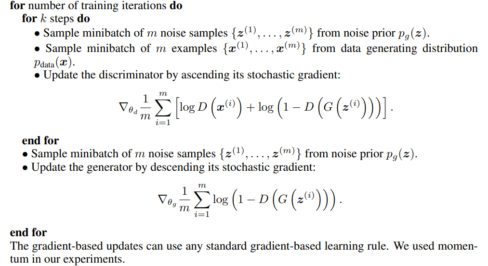

논문에서는 위와 같이 Discriminator를 먼저 학습 시키고 Generator를 학습시키는 것을 반복하는 알고리즘을 제시하였다. 

GAN의 minimax problem이 잘 동작한다고 말하기 다음 두가지를 증명해야한다.

1.  minimax problem이 데이터의 distribution과 generator 결과의 distribution이 같을 때 global optimum을 가진다.
2. Algorithm1 이 global optimum을 찾아준다.

### Global Optimality of pg = pdata

- **proposition1**

    G가 고정된 경우 최적의 D는 아래의 식과 같다.

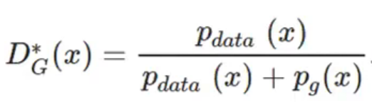

- **증명1**

    G를 고정하였으므로 V(G,D)를 단순히 maximize만 해주면 된다.

    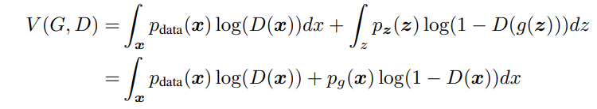

    기대값을 풀어서 쓰면 위와 같이 V(G,D)를 나타낼 수 있다. 확률값을 상수로 보고 V가 최대일 때 D를 구해야하므로 미분하면 D(x)가 proposition1과 같은 식이 나오는것을 알 수 있다.

**proposition1**을 사용해 ****V(G,D)를 다시 작성해보면 아래와 같다.

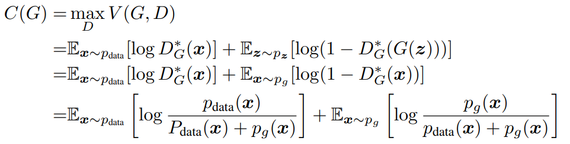

- **Theorem1**

    The global minimum of the virtual training criterion C(G) is achieved if and only if pg = pdata. At that point, C(G) achieves the value − log 4.

- **증명**

    두 p가 같다면 **proposition1**로 D(x)가 1/2이 된다. 따라서 C(G) = -log4가 된다. 

    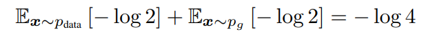

    이를 증명하기 위해 C(G)의 식을 아래와 같이 변경해볼 수 있다.

    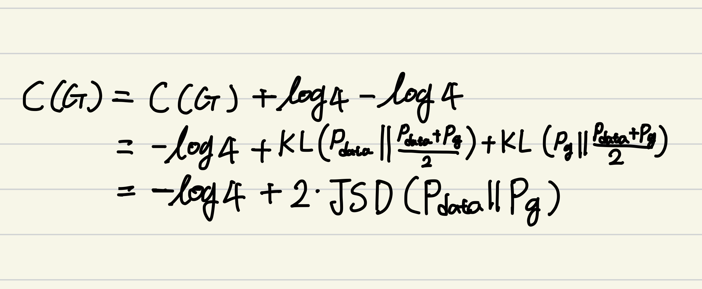

    JSD는 두 distribution이 일치할 경우에만 0이고 나머지 경우에는 양수이므로 C(G)는 두 P가 같을 때 -log4라는 global minimum을 갖는것을 알 수 있다.

    ### Convergence of Algorithm

    - **Proposition2**

        Algorithm1의 각 step에서 discriminator가 주어진 G에 대해 optimum에 도달하도록 허용하고, $p_g$가 업데이트되어 기준을 개선한다면 $p_g$는 $p_{data}$로 수렴한다.

        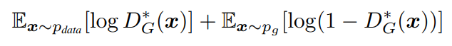

    - **증명**

        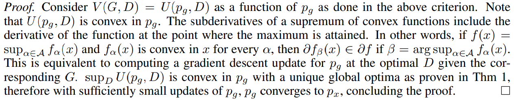

    # Experiments

    - 논문에서는 adversarial nets를 MNIST, TFD, CIFAR-10을 사용해 학습하였다.
    - Generator는 ReLU와 sigmoid activation을 혼합하여 사용하였고, Discriminator는 maxout activation을 사용하였다.
    - Discriminator를 학습할 때에는 dropout을 적용하였다.
    - 이론적인 프레임워크에서는 Generator의 중간층에 dropout과 noise를 허용하지 않지만, 실험에서 generator net 마지막 Layer에 input으로 noise를 사용하였다.
    - Generator로 생성된 sample에 Gaussian Parzen window를 피팅하고 해당 분포에 따른 log likelihood를 알려줌으로써 Pg에 따른 test set data를 추정하였다.

    # Advantages and disadvantage

    ### Advantage

    - Markov chains이 전혀 필요 없고 gradients를 얻기 위해 back-propagation만이 사용된다.
    - 학습 중 inference가 필요 없다.
    - Markov chains를 쓸때보다 선명한 이미지를 얻을 수 있다.

    ### disadvantage

    - D와 G가 균형을 잘 맞춰 성능이 향상되어야 한다.
        - G가 D가 발전하기 전에 더 만이 발전되어서는 안된다. (G가 z데이터를 너무 많이 붕괴시켜버리기 때문)
    - Pg(x)가 명시적으로 존재하지 않는다.